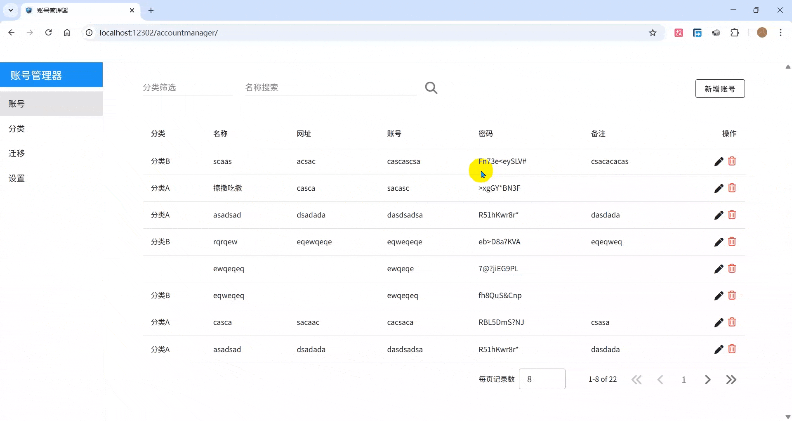
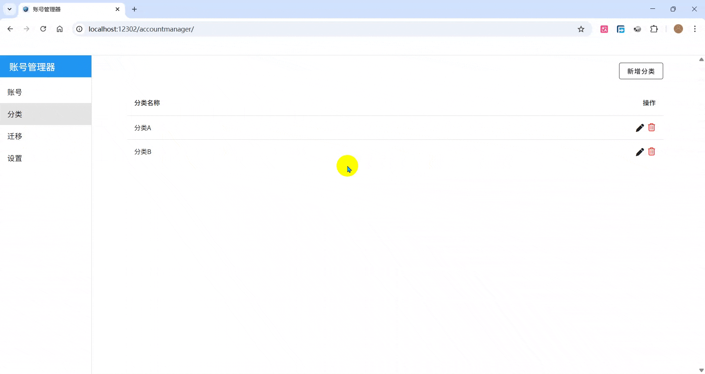
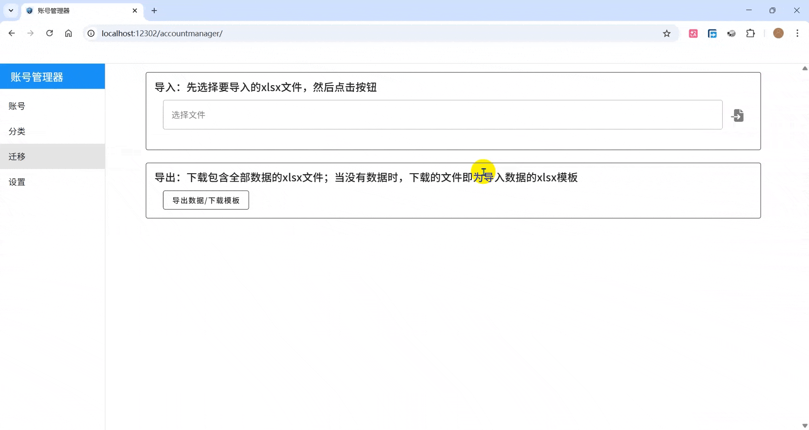
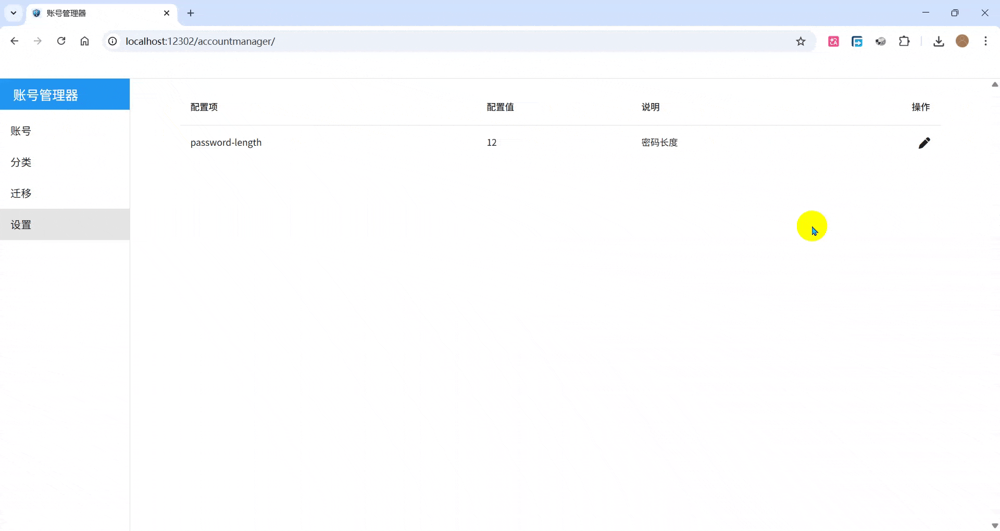

# Account Manager

账号管理器：管理自己在网站、APP的账号密码。

## 诞生

一些优秀的 [密码管理软件](https://www.zhihu.com/question/27338793) ，但是我想自定义。  

## 特点

1. 经济性：跨平台，免费。
2. 安全性：本地加密，秘钥、软件、数据文件三者合一才能知道明文。
3. 云存储：云盘私有存储；通过云盘文件夹同步功能可以自动把数据文件更新到云盘。
4. 方便性：不喜欢必须要输入一个管理密码才能打开密码管理软件的做法。  
5. 扩展性：可以自行添加想要的功能。

## 安装与使用

1. 配置 java 环境，建议 java21 及以上 LTS 版本。
2. 前往 [发布页面](https://github.com/drintau/AccountManager/releases) 下载最新版压缩包，解压。
3. 复制一份对应操作系统的示例配置文件 `application-xxx.properties` ，改名为 `application.properties` 。
4. 执行对应操作系统的脚本 `account-manager-key` 获得一个随机秘钥，配置到 `am.security-key` 。
5. 选定本机可正常访问的路径为数据文件存储路径，配置到 `am.file-path` 。
6. 执行对应操作系统的脚本 `account-manager-start` 启动程序。
7. 更多请阅读压缩包里面的 `说明.txt` 。

## 云存储

1. 启用备份功能，把备份目录设置为云盘文件夹自动同步目录。
2. 每次程序退出，会自动把当前数据文件拷贝一份到备份目录。
3. 腾讯微云同步助手/百度网盘/坚果云等网盘都有文件夹自动同步功能。
4. 注意：程序使用的数据文件不能作为云盘自动同步文件，多个程序同时访问数据文件会导致文件损坏，此时只能找备份恢复使用。

## 建议

1. 配置文件、数据文件可以有多个备份。
2. 每次升级前，先导出现有数据。

## 软件截图

