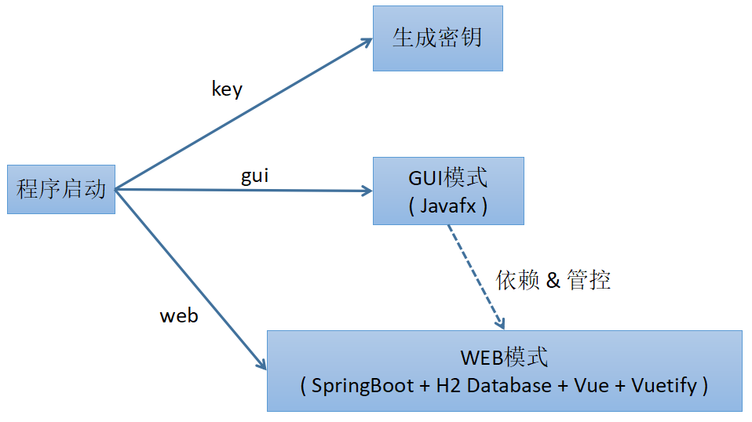
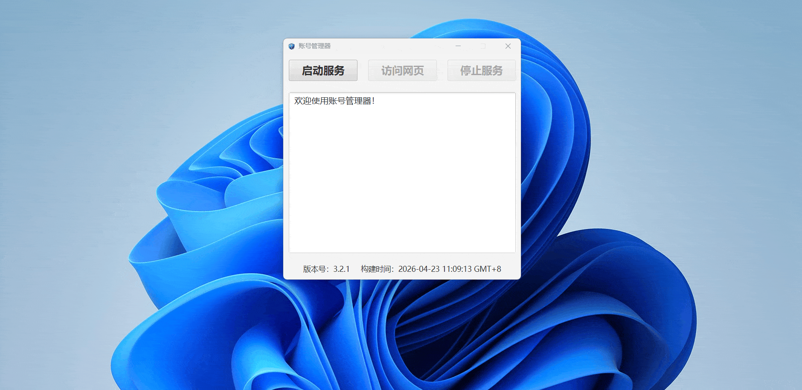

# Account Manager

账号管理器：支持 **单机离线运行** / **局域网部署运行** 的账号密码管理工具。

## 整体架构

## 诞生

市面已有成熟优秀的 [密码管理软件](https://www.zhihu.com/question/27338793) ，但本项目主打满足个性化使用需求。

## 特点

1. 基于 Java ，跨平台，免费。
2. 本地无网络可用，作为单机桌面软件使用；也可以局域网部署作为 web 服务。
3. 本地加密，配置文件、数据文件、软件三者一起使用才能知道明文。
4. 使用单文件数据库存储数据，可以通过网盘的文件夹备份/同步功能，做到自动私有云存储。
5. 没有必须设置管理软件的密码这种要求（一些密码管理软件要求设置一个管理密码，后续每次打开数据都要先输入管理密码）。  
6. 开源，可以自行添加功能。

## 安装与使用

1. 下载 [Java](https://adoptium.net/zh-CN/temurin/releases) 并搭建运行环境，建议 Java 21 及以上 LTS 版本。
2. 前往 [发布页面](https://github.com/drintau/AccountManager/releases) 下载最新版压缩包，解压。
3. 复制一份对应操作系统的示例配置文件 `application-xxx.properties` ，改名为 `application.properties` 。
4. 执行对应操作系统的脚本 `account-manager-key` 获得一个随机密钥，配置到 `am.security-key` 。
5. 选定本机可正常访问的路径为数据文件存储路径，配置到 `am.file-path` 。
6. 执行对应操作系统的脚本 `account-manager-start` 启动程序。
7. 请阅读压缩包里面的 `说明.txt` 了解更多内容。

## 私有云存储

可借助百度网盘、坚果云、腾讯微云等工具的文件同步功能实现，使用注意事项：
1. 程序使用的数据文件不能直接作为网盘自动同步文件，多个程序同时访问数据文件会导致文件损坏，此时只能找备份恢复使用。
2. 备份功能只在桌面环境使用时才有效：启用备份功能，把备份目录设置为网盘自动同步目录，每次程序退出，会把当前数据文件拷贝一份到备份目录。

## 建议

1. 定期备份配置文件与数据文件，规避数据丢失风险。
2. 版本升级前优先导出数据，防止文件异常损坏。

## 软件动画

