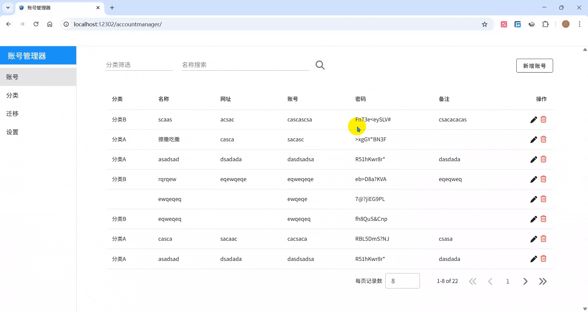
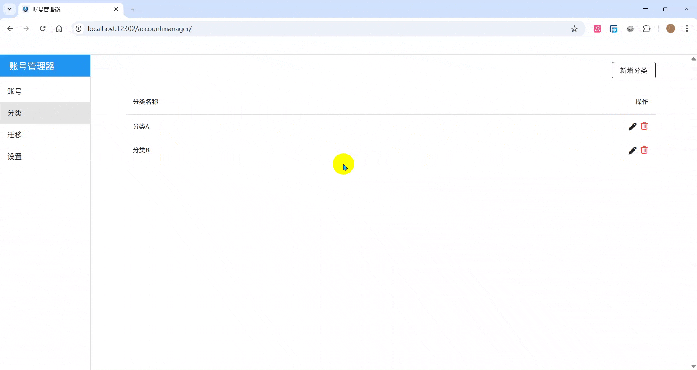
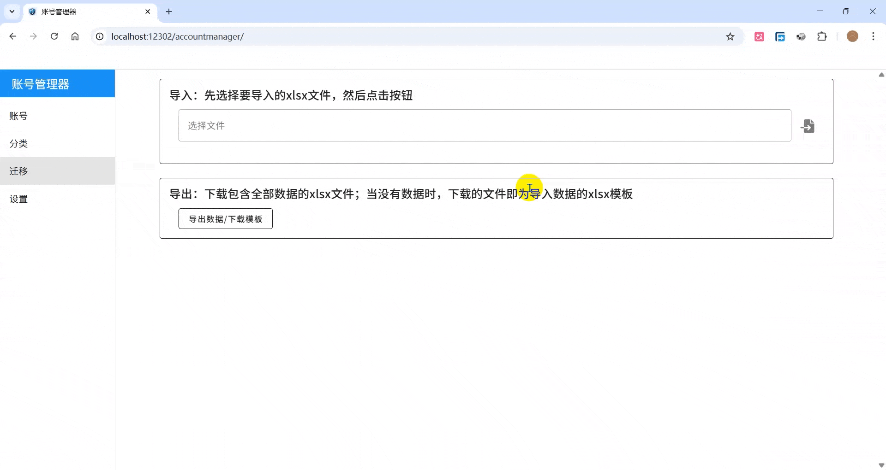
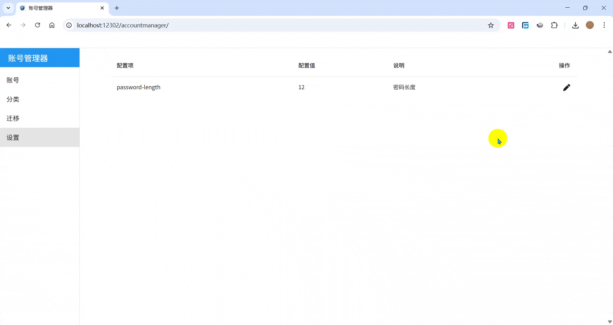

# Account Manager

账号管理器：管理自己在网站、APP的账号密码。

## 诞生

一些优秀的 [密码管理软件](https://www.zhihu.com/question/27338793) ，但是我想自定义。  

## 特点

1. 基于Java，跨平台，免费。
2. 本地无网络可用，作为单机桌面软件使用；也可以局域网部署作为web服务。
3. 本地加密，配置文件、数据文件、软件三者一起使用才能知道明文。
4. 使用单文件数据库存储数据，可以通过网盘的文件夹备份/同步功能，做到私有云存储。
5. 没有设置管理软件的密码这种要求（个人不喜欢一些密码管理软件，需要设置一个管理密码，后续每次打开数据都要先输入管理密码）。  
6. 开源，可以自行添加想要的功能。

## 安装与使用

1. 配置 java 环境，建议 java21 及以上 LTS 版本。
2. 前往 [发布页面](https://github.com/drintau/AccountManager/releases) 下载最新版压缩包，解压。
3. 复制一份对应操作系统的示例配置文件 `application-xxx.properties` ，改名为 `application.properties` 。
4. 执行对应操作系统的脚本 `account-manager-key` 获得一个随机秘钥，配置到 `am.security-key` 。
5. 选定本机可正常访问的路径为数据文件存储路径，配置到 `am.file-path` 。
6. 执行对应操作系统的脚本 `account-manager-start` 启动程序。
7. 更多请阅读压缩包里面的 `说明.txt` 。

## 私有云存储

百度网盘、坚果云、腾讯微云同步助手等常见网盘都有类似的功能，注意事项如下：
1. 程序使用的数据文件不能直接作为网盘自动同步文件，多个程序同时访问数据文件会导致文件损坏，此时只能找备份恢复使用。
2. 备份功能只在桌面环境使用时才有效：启用备份功能，把备份目录设置为网盘自动同步目录，每次程序退出，会把当前数据文件拷贝一份到备份目录。

## 建议

1. 配置文件、数据文件最好有备份。
2. 每次升级前，先导出现有数据，预防数据文件出现意外损坏。

## 软件截图

