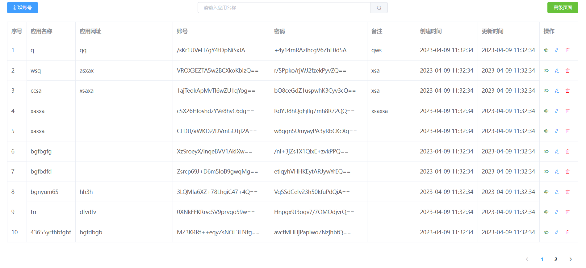
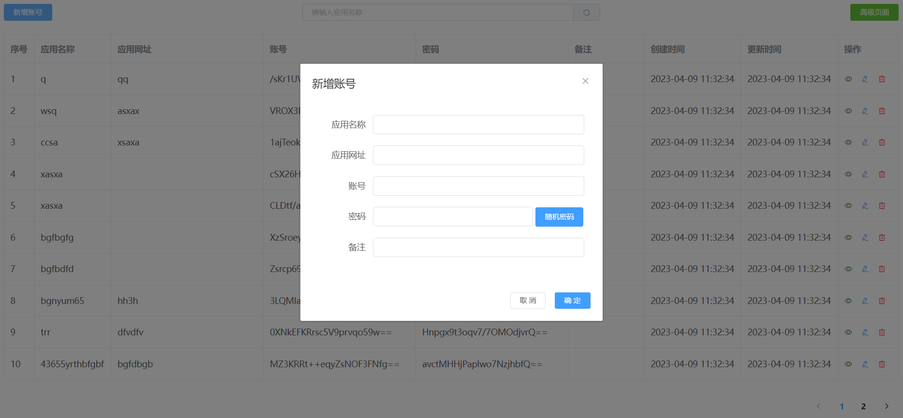
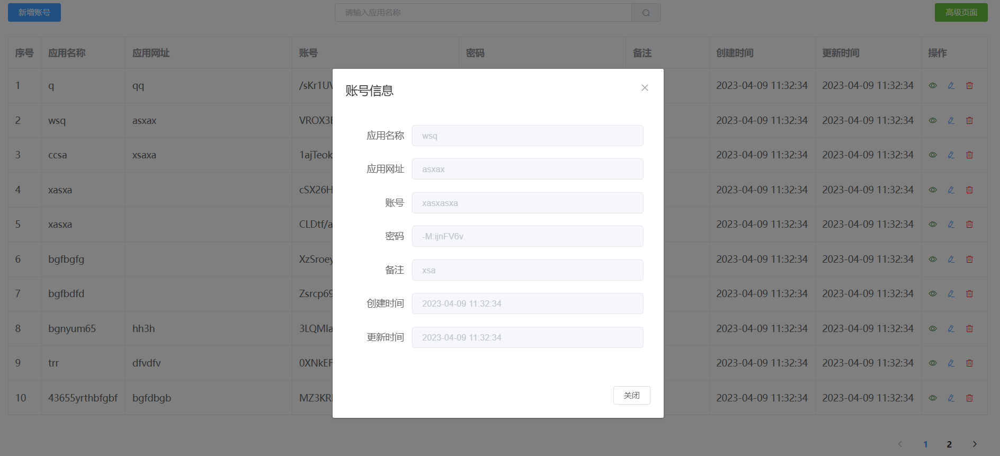
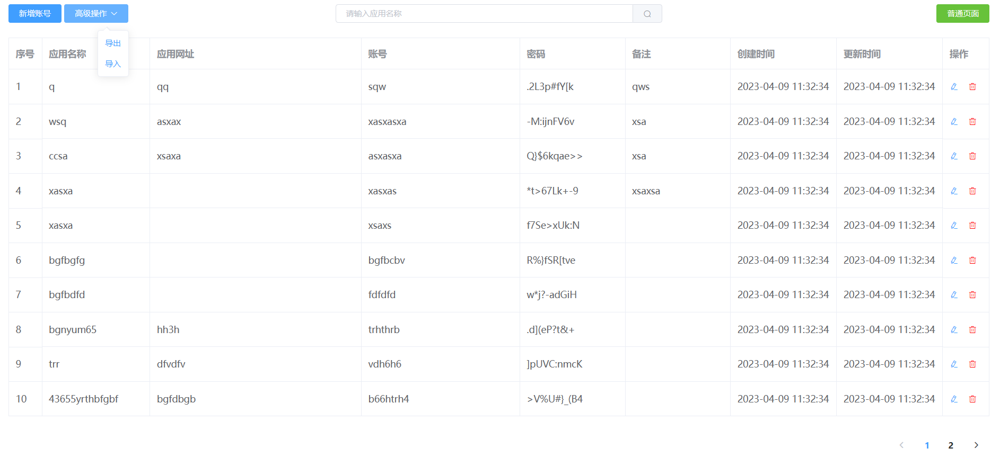

## 诞生

已有的一些 [密码管理软件](https://www.zhihu.com/question/27338793) 不符合定制需求，所以定制一个。

## 特点

1. 经济性：跨平台，免费。
2. 安全性：本地加密，秘钥、软件、密文文件三者合一才能知道明文。
3. 在线存储：云盘私有存储。
4. 自动更新：云盘同步文件夹功能，自动把密文文件更新到云盘。
5. 方便性：不想记密码，配置文件配置加解密秘钥。
6. 扩展性：自己要什么功能可以自己添加。

## 安装与使用

1. 安装配置java环境，java11以上。
2. 到 [发布页面](https://github.com/drintau/AccountManager/releases) 下载最新版压缩包，解压到一个不带中文的目录。
3. 复制一份对应操作系统的示例配置文件`application-xxx.properties`，改名为`application.properties`。
4. 执行`java -jar account-manager.jar --securityKey`获得一个随机秘钥；把秘钥填到`application.properties`的`am.security-key=`后面。
5. 配置`am.file-path=`后面的数据文件路径为本机可访问的路径。
6. 执行`java -jar account-manager.jar`启动程序。
7. 更多请阅读`说明.txt`

## 云盘同步

1. 启用备份功能，把备份目录设置为云盘同步目录。
2. 每次程序退出，会自动把当前密文文件拷贝一份到备份目录。
3. 腾讯微云同步助手/百度网盘/坚果云都有同步目录功能，会把同步目录内变动的文件同步到云。
4. 还有其他网盘请自行尝试。
5. 注意：程序使用的密文文件不能作为同步文件，多个程序访问密文文件会导致文件损坏，此时只能找备份恢复使用。

## 建议

1. 配置文件多几个备份，免得配置文件坏了解不出账号密码；密文文件也可以多几个备份。
2. 配置文件和密文文件放在同一个网盘比较容易找到。
3. 只有自己一个人看密码时才可点击“高级页面”！
4. 每次升级前，先导出现有数据做备份。

## 软件截图

